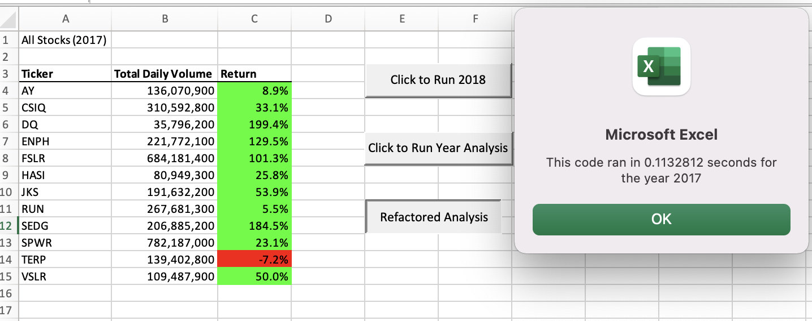
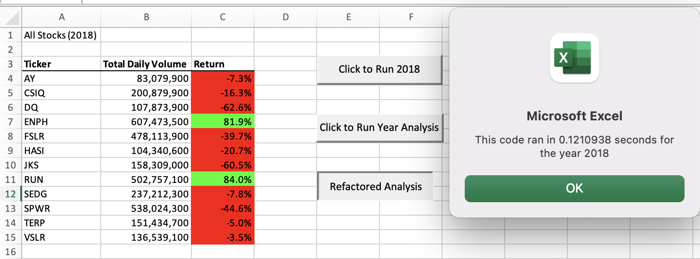

# stock_analysis_challenge
Module 2 Challenge using VBA to analyze stocks performance

## Overview of Project: Explain the purpose of this analysis

1. The project uses visual basic for applications (VBA) to evaluate the performance of various stocks over the course of two fiscal years. 

### Purpose:

1. The purpose is to gain proficiency using VBA, For loops, and conditionals to analyze stocks performance and determine the annual return on investment (ROI) over two different years.

# Results

* As shown in the images below, it can be observed that in general the 2017 ROI was greater than 2018 for all stocks except for RUN which performed better in 2018 and TERP which performed somewhat better in 2018.  Of note, only ENPH and RUN had mutiple years of positive ROI while the other stocks were mixed results.   

* Please note the execution times as shown below for 2017 and 2018, respectively. It can be observed that the execution times were indeed faster for the refactored script as compared to the original script. 

* Original Script

* Refactored Script

# Summary

* The advantages of refactoring code include a utilization of less memory, faster execution times, and easier to read lines of code.  The disadvantages include the additional work of editing without adding new functionality to the code. 

* The advantages of refactoring the original code include significantly faster execution times (as shown above). There were no major disadvantages of refactoring the original VBA code. 

